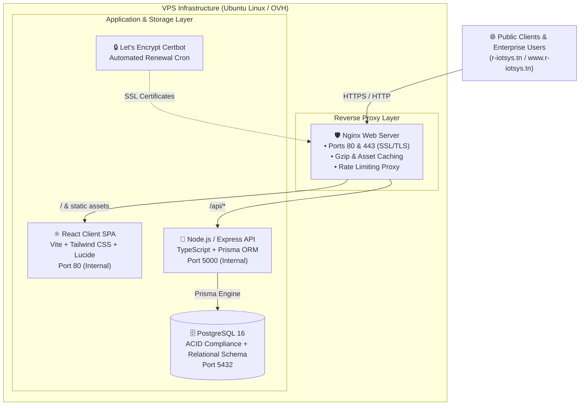

<div align="center">

# ⚡ R-IoTSys™ — Enterprise Engineering Platform & CMS

**Next-Generation Industrial IoT, Robotics & Embedded Systems Digital Infrastructure**

[](https://www.typescriptlang.org/)
[](https://reactjs.org/)
[](https://vitejs.dev/)
[](https://nodejs.org/)
[](https://expressjs.com/)
[](https://www.postgresql.org/)
[](https://www.prisma.io/)
[](https://tailwindcss.com/)
[](https://www.docker.com/)
[](LICENSE)

<br/>

[🌐 Live Website](https://r-iotsys.tn) • [🔐 Admin Portal](https://r-iotsys.tn/admin) • [📖 Documentation](#-table-of-contents) • [🐛 Report Issue](https://github.com/Atef-AK/RIOT-SYSTEMS/issues)

</div>

---

## 📑 Table of Contents

- [Executive Summary](#-executive-summary)
- [System Architecture](#-system-architecture)
- [Core Features & Capabilities](#-core-features--capabilities)
- [Technology Stack](#-technology-stack)
- [Repository Structure](#-repository-structure)
- [Quick Start Guide](#-quick-start-guide)
  - [Prerequisites](#prerequisites)
  - [Local Development Setup](#local-development-setup)
  - [Docker Production Deployment](#docker-production-deployment)
- [Admin CMS & Management Suite](#-admin-cms--management-suite)
- [REST API Reference](#-rest-api-reference)
- [Security & Reliability](#-security--reliability)
- [DevOps & SSL Automation](#-devops--ssl-automation)
- [License & Author](#-license--author)

---

## 🔬 Executive Summary

**R-IoTSys** ([r-iotsys.tn](https://r-iotsys.tn)) is a specialized engineering enterprise delivering end-to-end hardware and software solutions across:
- **Industrial IoT & SCADA**: Modbus, CAN Bus, MQTT, OPC UA, edge intelligence.
- **Embedded Robotics**: Autonomous navigation, ROS2, sensor fusion, real-time motor control.
- **PCB Design & Rapid Prototyping**: High-speed digital design, multilayer impedance control, SMD assembly.
- **Machine Vision & Smart Automation**: Edge AI object detection, automated optical inspection, quality control.

This repository powers the complete digital presence of **R-IoTSys**, including an ultra-responsive client portal with dynamic **i18n** (English, French, Arabic), a customized **Content Management System (CMS)** with granular Role-Based Access Control (RBAC), and automated containerized deployment pipelines.

---

## 🏗️ System Architecture



---

## ✨ Core Features & Capabilities

### 🌐 Public Portal (Client-Facing)
| Feature | Description |
|---|---|
| **Multi-Language Support (i18n)** | Seamless real-time switching across **English**, **French**, and **Arabic** (with RTL support). |
| **Interactive Service Catalog** | Deep-dive engineering capability showcases (IoT, Robotics, PCB Design, Machine Vision). |
| **Case Studies & Portfolio** | Technical project showcases detailing challenges, architectures, tech stacks, and tangible deliverables. |
| **Engineering Inquiries Engine** | Contact & RFP intake with anti-spam honeypot defense, field validation, and email dispatches. |
| **Modern Cyberpunk UI/UX** | Dark glassmorphism, glowing accents, fluid micro-interactions, responsive grid layouts. |

### 🛠️ Enterprise CMS (Admin-Facing)
| Module | Capabilities |
|---|---|
| **📊 Real-time Dashboard** | Live statistical metrics: message count, active services, completed projects, system status. |
| **⚙️ Services Manager** | Full CRUD for engineering disciplines, icons, tags, features, and sort orders. |
| **🚀 Projects Showcase Manager** | Case study creator with rich content, challenge/solution breakdowns, gallery attachments. |
| **📬 Inquiries Inbox** | Triage incoming leads with status tags (`New`, `Read`, `In Progress`, `Replied`, `Archived`) & internal notes. |
| **🖼️ Media Library** | Upload, preview, and organize schematics, hardware photos, and document attachments. |
| **👥 Team & Testimonials** | Manage leadership profiles and client success references. |
| **🔒 RBAC & User Management** | Multi-tier authorization (`SUPER_ADMIN`, `ADMIN`, `EDITOR`) with password policy enforcement. |
| **📜 Security Audit Logs** | Comprehensive chronological activity trail capturing all administrative actions. |

---

## 💻 Technology Stack

### Frontend Ecosystem
- **Core Framework**: [React 18](https://reactjs.org/) with [TypeScript](https://www.typescriptlang.org/)
- **Build Tool**: [Vite](https://vitejs.dev/)
- **Styling & Design System**: [Tailwind CSS 3](https://tailwindcss.com/) + PostCSS
- **Routing**: [React Router DOM v6](https://reactrouter.com/)
- **Data Fetching & State**: [TanStack Query](https://tanstack.com/query) + Context API
- **Icons & Visuals**: [Lucide React](https://lucide.dev/)
- **Form Handling & Validation**: [React Hook Form](https://react-hook-form.com/) + [Zod](https://zod.dev/)
- **Animations**: [Framer Motion](https://www.framer.com/motion/)

### Backend Ecosystem
- **Runtime Environment**: [Node.js 20 LTS](https://nodejs.org/)
- **Web Framework**: [Express.js](https://expressjs.com/) (TypeScript)
- **Database ORM**: [Prisma ORM](https://www.prisma.io/)
- **Database Engine**: [PostgreSQL 16](https://www.postgresql.org/)
- **Authentication**: JWT (JSON Web Tokens) + [BcryptJS](https://github.com/dcodeIO/bcrypt.js)
- **Security Middleware**: [Helmet](https://helmetjs.github.io/), [CORS](https://github.com/expressjs/cors), [Express Rate Limit](https://github.com/express-rate-limit/express-rate-limit)
- **File Processing**: [Multer](https://github.com/expressjs/multer)
- **Email Dispatch**: [Nodemailer](https://nodemailer.com/) (Async non-blocking dispatch)

---

## 📂 Repository Structure

```text
RIOT-SYSTEMS/
├── 📁 backend/                    # Express + Prisma REST API
│   ├── 📁 prisma/                 # Database schema & seeder scripts
│   │   ├── schema.prisma          # Relational PostgreSQL models
│   │   └── seed.ts                # Initial production seed script
│   ├── 📁 src/
│   │   ├── 📁 config/             # Environment, DB, & JWT configurations
│   │   ├── 📁 controllers/        # Business logic controllers
│   │   ├── 📁 middleware/        # Auth, RBAC, Uploads, Rate-limit, Error handlers
│   │   ├── 📁 routes/            # REST API route definitions
│   │   ├── 📁 services/          # Email notifications & audit logging
│   │   ├── 📁 utils/             # Helpers, slugs, response formatters
│   │   └── index.ts              # Express application entry point
│   ├── package.json
│   └── tsconfig.json
├── 📁 frontend/                   # React + TypeScript + Vite SPA
│   ├── 📁 public/                 # Static public assets & hardware imagery
│   ├── 📁 src/
│   │   ├── 📁 components/        # Reusable UI & Layout components
│   │   │   ├── 📁 admin/          # CMS Layout, Sidebar, TopBar, StatCards
│   │   │   ├── 📁 public/         # Hero, TechStack, Capabilities, ContactForm
│   │   │   └── 📁 ui/             # Buttons, Modals, Inputs, Switches, Badges
│   │   ├── 📁 context/           # AuthContext, LanguageContext, ToastContext
│   │   ├── 📁 i18n/              # Translations dictionary (EN, FR, AR)
│   │   ├── 📁 pages/             # Public & Admin route views
│   │   ├── 📁 services/          # API client (Axios/Fetch with interceptors)
│   │   ├── 📁 types/             # TypeScript domain interfaces
│   │   ├── App.tsx               # Route declarations
│   │   └── main.tsx              # React mounting root
│   ├── package.json
│   ├── tailwind.config.js
│   └── vite.config.ts
├── 📁 docker/                     # Containerization blueprints
│   ├── backend.Dockerfile         # Production Node.js multi-stage build
│   ├── frontend.Dockerfile        # Production Vite build + Nginx static server
│   └── nginx.conf                 # Edge reverse proxy configuration
├── 📁 docs/                       # Project blueprints & architecture notes
├── .env.example                   # Master environment variable template
├── .gitignore                     # Git ignore rules (protects credentials & builds)
├── docker-compose.yml             # Full-stack multi-container orchestrator
└── README.md                      # Platform documentation
```

---

## 🚀 Quick Start Guide

### Prerequisites
- **Node.js**: `v20.x` or higher
- **Package Manager**: `npm` (`v10.x`+) or `yarn` / `pnpm`
- **PostgreSQL Database**: Local installation or running via Docker

---

### Local Development Setup

#### 1. Clone the repository
```bash
git clone https://github.com/Atef-AK/RIOT-SYSTEMS.git
cd RIOT-SYSTEMS
```

#### 2. Backend Setup
```bash
cd backend
npm install

# Configure environment
cp .env.example .env
# Edit .env with your local PostgreSQL credentials

# Initialize Database Schema & Seed Data
npx prisma generate
npx prisma db push
npx prisma db seed

# Launch Backend Development Server (Port 5000)
npm run dev
```

#### 3. Frontend Setup
```bash
# In a separate terminal
cd frontend
npm install

# Launch Frontend Development Server (Port 5173)
npm run dev
```
Open **[http://localhost:5173](http://localhost:5173)** in your browser.

---

### Docker Production Deployment

Run the complete multi-container stack with a single command:

```bash
# Start all containers in detached mode
docker compose up -d --build

# Run database schema migrations & initial seed
docker compose exec backend npx prisma db push
docker compose exec backend npm run prisma:seed
```

---

## 🔐 Admin CMS & Management Suite

The administrative portal is accessible at `/admin`.

```text
┌────────────────────────────────────────────────────────┐
│               R-IoTSys™ Admin Portal                   │
│         https://r-iotsys.tn/admin/login                │
├─────────────────────────┬──────────────────────────────┤
│ Default Admin Account   │ admin@r-iotsys.tn            │
│ Initial Password        │ Admin@Riotsys2026!           │
│ Access Level            │ SUPER_ADMIN                  │
└─────────────────────────┴──────────────────────────────┘
```
> ⚠️ **Security Notice**: Update the default super admin password immediately after initial setup via the **Admin Users** panel.

---

## 📡 REST API Reference

| Method | Endpoint | Access | Description |
|---|---|---|---|
| `POST` | `/api/auth/login` | Public | Authenticate user & receive JWT token |
| `GET` | `/api/auth/me` | Authenticated | Retrieve authenticated user profile |
| `GET` | `/api/services` | Public | Retrieve active engineering services |
| `POST` | `/api/services` | Admin / Editor | Create a new engineering service |
| `GET` | `/api/projects` | Public | Retrieve published case studies |
| `POST` | `/api/projects` | Admin / Editor | Create a new project case study |
| `POST` | `/api/messages` | Public (Rate-Limited) | Submit a client inquiry / RFP |
| `GET` | `/api/messages` | Admin | Retrieve inquiry inbox list |
| `PATCH` | `/api/messages/:id` | Admin | Update message status & internal notes |
| `GET` | `/api/stats` | Admin | Aggregate dashboard metrics |
| `POST` | `/api/media/upload` | Admin / Editor | Upload files/images (Multipart form) |
| `GET` | `/api/activity-logs` | Super Admin | View historical audit logs |

---

## 🛡️ Security & Reliability

- **Zero SQL Injection Risk**: All database interactions use parameterized queries via Prisma Engine.
- **DDoS & Brute-Force Shield**: Multi-tiered rate limiting on authentication and inquiry submission endpoints.
- **Anti-Spam Defense**: Transparent honeypot traps and sanitized inputs.
- **Fail-Safe Inquiry Logging**: Inquiries are guaranteed to be stored in PostgreSQL even if third-party SMTP servers experience transient downtime.
- **Cryptographic Security**: Passwords hashed with high-entropy Bcrypt (Salt rounds = 12); stateless JWT authentication.

---

## 🌐 DevOps & SSL Automation

The deployment architecture includes automated certificate lifecycle management via Let's Encrypt Certbot.

```bash
# Automated certificate setup
sudo certbot --nginx -d r-iotsys.tn -d www.r-iotsys.tn --non-interactive --agree-tos -m contact@r-iotsys.tn
```

---

## 👨‍💻 Author & Contact

**Atef**
- 🌐 **Website**: [https://r-iotsys.tn](https://r-iotsys.tn)
- 📧 **Contact**: [contact@r-iotsys.tn](mailto:contact@r-iotsys.tn)
- 📍 **Location**: Tunis, Tunisia
- 🐙 **GitHub**: [@Atef-AK](https://github.com/Atef-AK)

---

<div align="center">
  <sub>Built with precision for the future of connected hardware & industrial automation. © 2026 R-IoTSys by Atef. All rights reserved.</sub>
</div>

